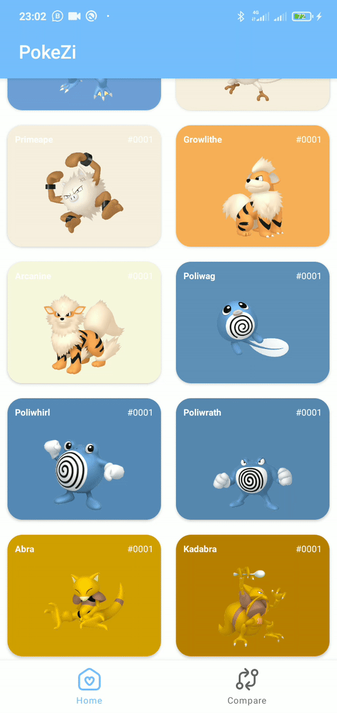

**PokeZi Project: Exploring the Pokémon World with Some Seriously Cool Style**

Hey there, folks! Welcome to the awesome PokeZi Project documentation! This cool app is here to take you on an exciting journey into the Pokémon world like you've never experienced before. Using cutting-edge technologies like the Pokemon API, MVVM, Clean Architecture, Paging 3, Retrofit, Glide, and MPAndroidChart, PokeZi is geared up to provide an exhilarating experience for all you Pokémon fans out there.

## Key Highlights

- **Slick Pokedex**: Check out the complete list of Pokémon with all the nitty-gritty details like types, stats, and fascinating descriptions.

- **Engaging Exploration**: Dive into each Pokémon with smooth swipe animations and in-depth, info-packed detail views.

- **Cool Stat Graphics**: Jazz up your information with interactive stat graphics courtesy of MPAndroidChart.

- **Seeing Pokémon**: Browse through the Pokémon roster like a breeze using the slick Paging 3.

## Technologies at Play

- **Pokemon API**: Hook up with the Pokemon API to get the latest scoop on all sorts of Pokémon species.

- **MVVM (Model-View-ViewModel)**: Get smart with the MVVM architecture to keep the complex stuff separate from the slick user interface.

- **Clean Architecture**: Keep the project organized with some Clean Architecture goodness to amp up scalability and make maintenance a breeze.

- **Paging 3**: Make perusing the Pokémon list a joy with the help of Paging 3, keeping things smooth and lightweight.

- **Retrofit**: Communicate with the Pokemon API seamlessly and efficiently with Retrofit.

- **Glide**: Load up and show off those Pokémon images lightning-fast and memory-friendly with Glide.

- **MPAndroidChart**: Amp up the coolness factor by creating some eye-catching statistical visualizations with MPAndroidChart.

## Demo

Curious to see PokeZi in action? Check out this awesome demo:

## Contributions

We're all ears for contributions from all you fine folks out there. If you've got something to add, just throw in a pull request, and we'll be stoked to dive in and merge it.

## Development Team

- Akhmad Fauzi ([@A-fauzi](https://github.com/A-fauzi))

## License

This project is licensed under the MIT License
